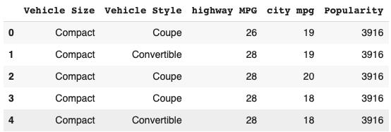
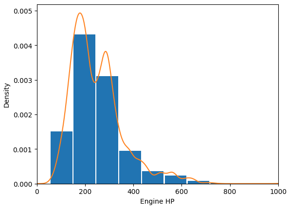
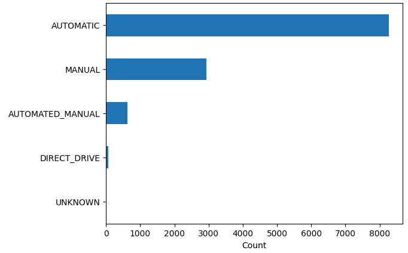
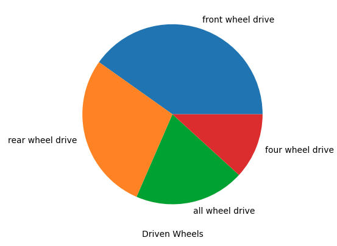
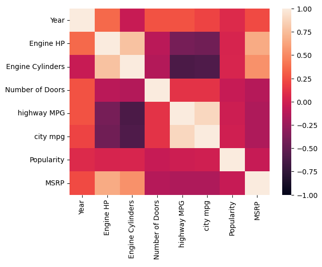
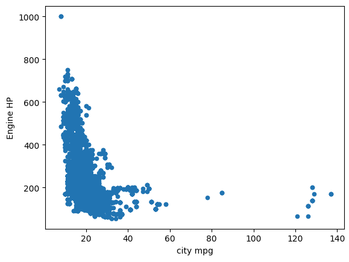
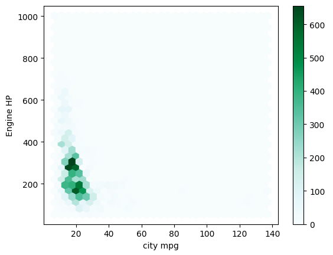
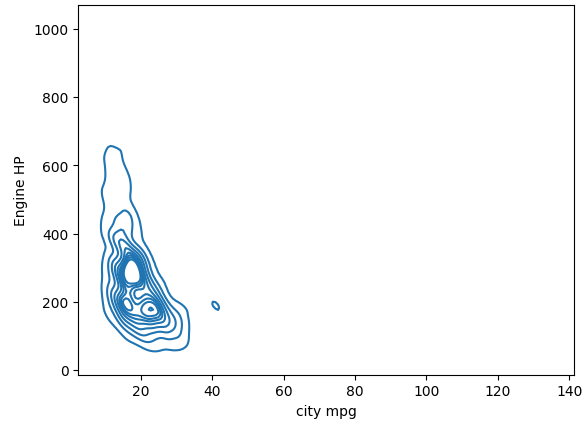

# Exploratory Data Analysis (EDA)

**Exploratory Data Analysis** (*EDA*) is a crucial initial phase in the data analysis process, where the primary objective is to explore and understand the main characteristics of a dataset. It involves a variety of techniques and methods to summarize, visualize, and interpret the data in order to gain insights and identify patterns that may inform further analysis or modeling.

Explore the main concepts of EDA through Python code, available [here](https://github.com/dmydud/math-for-data-science/blob/main/EDA/EDA_python_theory.ipynb).

## Data Types

There are two basic types of data: **numeric** (*quantitative*) and **categorical** (*qualitative*).

1. **Numeric Data**:
   - *Continuous*: Represents measurements that can take on any value within a range. Examples include height, weight, and temperature.
   
   - *Discrete*: Consists of countable values with clear separations between them. Examples include the number of siblings, number of cars owned, and number of pets.

2. **Categorical Data** represents qualitative characteristics or attributes that do not have inherent numerical value. Categorical data can be further subdivided into:
     - *Nominal*: Consists of categories with no inherent order or ranking. Examples include gender, eye color, and car brands.
        - *Binary*: A special case of nominal data where there are only two categories. Examples include yes/no, true/false, and 0/1.
     - *Ordinal*: Consists of categories with a clear ordering or ranking. However, the differences between the categories may not be uniform. Examples include education level (e.g., high school, bachelor's degree, master's degree) and socioeconomic status (e.g., low, medium, high).

## Tabular (Rectangular) Data
Tabular (rectangular) data refers to a structured format resembling a spreadsheet or database table. This type of data is typically represented as a matrix, where rows and columns intersect to denote specific data points. Each row corresponds to a single observation (**record**), while each column represents a distinct attribute or characteristic of the data (**feature**).

Example of tabular data

Before data can be represented in a tabular format, unstructured data (such as text or images) needs to be processed and manipulated to extract relevant information and organize it into rows and columns.

In programming languages such as R and Python, the *DataFrame* is a specific data structure designed for handling tabular data. It provides functionalities for data manipulation, analysis, and visualization, making it a powerful tool for data scientists and analysts.

## Central Tendency
A basic step in exploring data is obtaining a "typical value" for each feature (variable), in other words, a measure of central tendency.

### Mean
The most basic central tendency is the mean, or average value. The symbol $\bar{x}$ being used to represent the mean of a sample from a population.

The formula to compute the mean for a set of $n$ values $x_1, x_2, \dots, x_n$ is:
$$\text{Mean}=\bar{x}=\frac{1}{n}\sum_{i=1}^{n}x_i$$

### Outliers
There are other measures of central tendency known as robust measures, which are not influenced by *outliers* (extreme cases) that could skew the results. An outlier is any value that is very distant from the other values in a data set.

Being an outlier in itself does not make a data value invalid or erroneous. Still, outliers are often the result of data errors such as mixing data of different units (kilometers versus meters) or bad readings from a sensor. When outliers are the result of bad data, the mean will result in a poor estimate of location, while the median will still be valid. In any case, outliers should be identified and are usually worthy of further investigation.

### Trimmed Mean
A variation of the mean is a *trimmed mean* (truncated mean), which you calculate by dropping a fixed number of sorted values at each end and then taking an average of the remaining values.

Representing the sorted values by $x_{(1)}, x_{(2)}, \dots, x_{(n)}$ where $x_{(1)}$ is the smallest value and $x_{(n)}$ the largest, the formula to compute the trimmed mean with $p$ smallest and largest values omitted is:
$$\text{Trimmed mean}=\bar{x}=\frac{1}{n-2p}\sum_{i=p+1}^{n-p}x_{(i)}$$

Trimming the bottom and top 10% (a common choice, but it depends on the specific characteristics of the data and the analysis requirements) of the data will provide protection against outliers in all but the smallest data sets. The trimmed mean can be thought of as a compromise between the median and the mean: it is robust to extreme values in the data, but uses more data to calculate the estimate for location.

### Weighted Mean
Another type of mean is a *weighted mean*.

Let we have weight $w_i$ for each data value. The formula for a weighted mean is:

$$\text{Weighted mean} = \bar{x} = {\left(\sum^n_{i=1} x_i w_i\right)} / {\left(\sum^n_{i=1} w_i\right)}$$

There are two primary reasons for employing a weighted mean:
- Variability in Values: In situations where certain data points exhibit higher variability compared to others, assigning lower weights to these highly variable observations is beneficial. For instance, if we're aggregating data from multiple sensors, and one sensor is less accurate than the others, we might opt to reduce the influence of data from that sensor by assigning it a lower weight.
- Unequal Representation of Data: When the collected data does not equally represent all the relevant groups of interest, adjustments can be made using weighted means. For example, in an online experiment where certain user groups are underrepresented due to the experiment's design, assigning higher weights to data from these underrepresented groups helps to ensure a more accurate representation of the entire user base.

### Median
The *median* is the middle number on a sorted list of the data. If there is an even number of data values, the middle value is one that is not actually in the data set, but rather the average of the two values that divide the sorted data into upper and lower halves.

Compared to the mean, which uses all observations, the median depends only on the values in the center of the sorted data. While this might seem to be a disadvantage, since the **mean is much more sensitive to the data**, there are many instances in which the median is a better metric for location.

### Weighted Median
For the same reasons that one uses a weighted mean, it is also possible to compute a weighted median. As with the median, we first sort the data, although each data value has an associated weight. Instead of the middle number, the weighted median is a value such that the sum of the weights is equal for the lower and upper halves of the sorted list.

Like the median, the weighted median is robust to outliers.

## Estimates of Variability
*Variability*, also referred to as *dispersion*, measure whether the data values are tightly clustered or spread out.

### Deviation
The most widely used estimates of variation are based on the differences, or *deviations*, between the central tendency and the observed data. These deviations tell us how dispersed the data is around the central value.

### Mean Absolute Deviation
One way to measure variability is to estimate a typical value for these deviations. Averaging the deviations themselves would not tell us much—the negative deviations offset the positive ones. In fact, the sum of the deviations from the mean is precisely zero.

Instead, a simple approach is to take the average of the absolute values of the deviations from the mean. This is known as the *mean absolute deviation* and is computed with formula:
$$\text{Mean absolute deviation}=\frac{1}{n}\sum^n_{i=1}|x_i-\bar{x}|$$

The mean absolute deviation provides a measure of the average distance between each data point and the mean, irrespective of their direction.

### Variance and the Standard Deviation
The best-known estimates of variability are the *variance* and the *standard deviation*, which are based on squared deviations. The variance is the average of the squared deviations from the mean, and the standard deviation is the square root of the variance.

$$\text{Variance}=s^2=\frac{1}{n-1}\sum^n_{i=1}(x_i-\bar{x})^2$$
$$\text{Standard deviation}=s=\sqrt{\text{Variance}}$$

The standard deviation is much easier to interpret than the variance since it is on the same scale as the original data.

The variance and standard devia‐ tion are especially sensitive to outliers since they are based on the squared deviations.

### Median Absolute Deviation from the Median
A robust estimate of variability is the *median absolute deviation from the median* or MAD:
$$\text{Median absolute deviation}=\text{Median}(|x_1-m|,|x_2-m|,\dots,|x_N-m|)$$
where $m$ is the median. 

Like the median, the MAD is not influenced by extreme values.

Sometimes, the median absolute devia‐ tion is multiplied by a constant scaling factor to put the MAD on the same scale as the standard deviation in the case of a normal dis‐ tribution. The commonly used factor of 1.4826 means that 50% of the normal distribution fall within the range ±MAD.

### Estimates Based on Percentiles
The most basic measure is the *range*: the difference between the largest and smallest numbers. 

The minimum and maximum values themselves are useful to know and are helpful in identifying outliers, but the range is extremely sensitive to outliers and not very useful as a general measure of dispersion in the data.

To avoid the sensitivity to outliers, we can look at the range of the data after dropping values from each end. Formally, these types of estimates are based on differences between percentiles. In a data set, the $P$th percentile is a value such that at least $P$ percent of the values take on this value or less and at least $(100 – P)$ percent of the values take on this value or more.

The percentile is essentially the same as a *quantile*, with quantiles indexed by fractions (so the .8 quan‐ tile is the same as the 80th percentile).

A common measurement of variability is the difference between the 25th percentile and the 75th percentile, called the *interquartile range* (or IQR).

## Exploring the Data Distribution
Each of the estimates we’ve covered sums up the data in a single number to describe the location or variability of the data. It is also useful to explore how the data is dis‐ tributed overall.

### Percentiles
Percentiles are also valuable for summarizing the entire distribution. It is common to report the *quartiles* (25th, 50th, and 75th percentiles) and the *deciles* (the 10th, 20th, ..., 90th percentiles).

### Boxplot
*Boxplot* are based on percentiles and give a quick way to visualize the distribution of data.

Example of the boxplot

The top and bottom of the box are the 75th and 25th percentiles, respectively. The median is shown by the horizontal line in the box. The dashed lines, referred to as *whiskers*, extend from the top and bottom of the box to indicate the range for the bulk of the data. By default, the R function extends the whiskers to the furthest point beyond the box, except that it will not go beyond 1.5 times the IQR. Matplotlib uses the same imple‐ mentation; other software may use a different rule.

Any data outside of the whiskers is plotted as single points or circles (often consid‐ ered outliers).

### Frequency Tables and Histograms
A frequency table of a variable divides up the variable range into equally spaced seg‐ ments and tells us how many values fall within each segment.

A histogram is a way to visualize a frequency table, with bins on the x-axis and the data count on the y-axis.

Example of the histogram

### Statistical Moments
If the function is a probability distribution, then the first moment is the expected value, the second central moment is the variance, the third standardized moment is the *skewness*, and the fourth standardized moment is the *kurtosis*.

### Density Plots
Related to the histogram is a density plot, which shows the distribution of data values as a continuous line. A density plot can be thought of as a smoothed histogram, although it is typically computed directly from the data through a *kernel density estimate*.

Example of the density plot

Note that the total area under the density curve = 1, and instead of counts in bins you calculate areas under the curve between any two points on the x-axis, which correspond to the proportion of the distribution lying between those two points.

## Exploring Binary and Categorical Data
Summarizing a binary variable or a categorical variable with a few categories is relatively straightforward: we calculate the proportions of the relevant categories.

Bar charts, commonly seen in the media, are frequently used to visually represent a single categorical variable. Categories are displayed on the x-axis, while frequencies or proportions are depicted on the y-axis.

Example of the bar plot

Pie charts offer an alternative to bar charts, although many statisticians and data visualization experts prefer bar charts due to their greater visual clarity.

Example of the pie chart

### Mode
The *mode* is the value—or values in the case of a tie—that occurs most frequently in the data.

### Expected Value
A distinct type of categorical data pertains to categories representing or aligning with discrete values on the same scale. The *expected value* is determined by multiplying each outcome by its probability of occurrence and then summing these products.

The expected value essentially functions as a form of weighted mean, incorporating notions of future expectations and probability weights, often informed by subjective judgment.

## Correlation
Variables X and Y, each with measured data, are considered positively correlated if high values of X correspond to high values of Y, and low values of X correspond to low values of Y. Conversely, if high values of X align with low values of Y, and vice versa, the variables are negatively correlated.

### Pearson's Correlation Coefficient
Pearson's correlation coefficient, denoted as $r$, is calculated using the formula:
$$r = \left(\sum^n_{i=1}(x_i-\bar{x})(y_i-\bar{y})\right) / \left((n-1)s_xs_y\right)$$
where $-1 \leq r \leq 1$. 

### Spearman's Rank Correlation Coefficient
Spearman's rank correlation coefficient, denoted as $\rho$, is computed as:
$$\rho = 1 - \left(6\sum^n_{i=1}(R(x_i) - R(y_i))\right) / \left(n(n^2-1\right))$$
where $-1 \leq \rho \leq 1$.

These coefficients are based on the rank of the data and are robust to outliers, handling certain nonlinear relationships well.

### Correlation Matrix
A correlation matrix is a table that displays correlations between multiple variables.

Heatmaps are commonly used to visualize correlation matrices.

Example of the correlation matrix heatmap

### Scatterplots
Scatterplots provide a standard visualization for understanding the relationship between two measured data variables. Each point on the plot represents a record, with one variable on the x-axis and the other on the y-axis.

Example of the scatterplot

## Exploring Two or More Variables
### Hexagonal Binning and Contours
Scatterplots are effective for visualizing relationships when dealing with a small number of data points. However, when dealing with large datasets containing hundreds of thousands or millions of records, scatterplots become too dense to interpret effectively.

In such cases, hexagonal binning provides an alternative approach. Instead of plotting individual points, the data is grouped into hexagonal bins. Each hexagon is colored according to the number of records it contains, providing a visual representation of density.

Example of the hexagonal bins

Contours, on the other hand, offer a topographical map-like view of two variables. Each contour band represents a specific density of points, akin to peaks and valleys on a map. This visualization conveys a similar story to hexagonal binning.

Example of the contour plot

Heatmaps, hexagonal binning, and contour plots all offer visual representations of two-dimensional density, serving as natural counterparts to histograms and density plots.

### Two Categorical Variables
Contingency tables are a useful tool for summarizing two categorical variables. These tables display counts by category and can optionally include column and total percentages.

### Categorical and Numeric Data
When comparing the distributions of a numeric variable across different categories of a categorical variable, boxplots offer a straightforward visualization.

An alternative to boxplots is the violin plot, which presents the density estimate along the y-axis. The shape resembles a violin, created by mirroring and flipping the density estimate. Violin plots excel at revealing subtle nuances in the distribution, whereas boxplots are better at highlighting outliers.

Example of the violin plot

### Visualizing Multiple Variables
To extend the comparison of variables beyond two, techniques like scatterplots, hexagonal binning, and boxplots can be employed through conditioning.

Example of the conditioning plot

## References:
- Bruce, P., & Bruce, A. (2017). Practical statistics for data scientists. O’Reilly Media.
